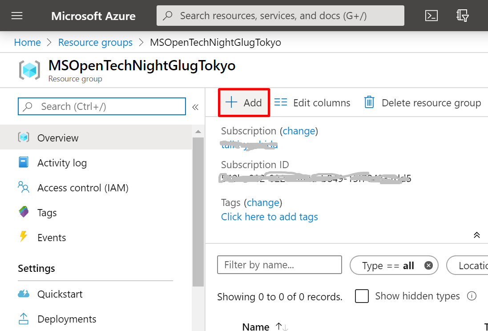
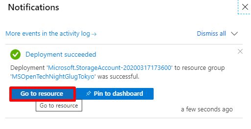

Power Apps Hands on
---

# 1. Environment prep and logins

## 1.1. Setting up Power Apps community plan

If you already have a community plan setup,<br>
you can skip this step.

1. Access the Power Apps community plan site<br>
https://powerapps.microsoft.com/en-us/communityplan/

2. Click on Get Started Free


3. Sign-up

Note: you cannot use personal mails like Gmail or Hotmail.

4. Authenticate with phone or SMS if requested <br>

5. If requested, enter the acquired authorization code to authenticate


6. Enter your account details and click Start


## 1.2. Register for Azure

If you already have an Azure environment, you can skip this step.

1. Access Azure website<br>
https://azure.microsoft.com/ja-jp/


2. Click on Start Free 


3. Click on Start free again<br>


4. Login with your Microsoft Account or GitHub account<br>


5. Fill-in the necessary details and click on Sign up


# 2. Preparing Azure

## 2.1. Create a resource group

1. Click on Resource Groups<br>


2. Click Add<br>


3. Set the parameters for resource group as below<br>


4. Click Create<br>


## 2.2. Creating Storage Account

1. Go to the resouce group you created, and click Add<br>


2. Select Storage Account<br>


3. Setup the details like below<br>


4. Click Create<br>


5. Once deployment is complete, click on Go to Resource<br>


6. Click on Containers<br>


7. Click on +Container


8. Specify like below and click Create<br>


9. Go to Access Keys, and obtain the Key from key1<br>


## 2.3. Create a Face API

1. Go to the resouce group you created, and click Add<br>


2. Select Face<br>


3. Click Create<br>


4. Setup the details like below<br>


5. Click on Go to Resource<br>


6. Obtain the codes from Key1<br>


# 3. Create a facial recognition app with Power Apps

## 3.1. Open Power Apps

1. Open Power Apps from https://make.powerapps.com<br>


2. Click Create Canvas App from blank<br>


3. Select Tablet as the choice of app type<br>


4. Power Apps studio will show up<br>


## 3.2. Make screens

### 3.2.1. Person Group 作成画面
In order to setup facial recognition using Face API you need to first setup a "Person Group" to register the user. We will first create a screen for that.

1. Change the screen name<br>


2. Open Datasources<br>


3. Select Face API<br>


4. Paste the Face API key. You will only need to do this for the first time.<br>


5. Go back to tree view<br>


6. Create a Textbox to enter the Person Group ID<br>


7. Change the name of Textbox to "PersonGroupIDInput"<br>


8. Change the property of PersonGroupIDInput to the following.<br>

|Property Name|Display Name|Value|
|:--|:--|:--|
|Default|Default||
|HintText|Hint Text|Set the Person ID here|


9. Create a lable for PersonIDInput<br>


|Property Name|Display Name|Value|
|:--|:--|:--|
|Text|Text|Person Group ID|


10. Also create the Textbox for Person Group Name as PersonGroupNameInput<br>


11. Create a button PersonGroupSubmitButton<br>


|Property Name|Display Name|Value|
|:--|:--|:--|
|Text|Text|Register|


12. PersonGroupSubmitButton の OnSelect プロパティに以下を指定する。

``` php
//Person Group 作成処理
FaceAPI.CreatePersonGroup(PersonGroupIDInput.Text,PersonGroupNameInput.Text);
```

13. Change the DisplayMode property of PersonGroupSubmitButton to below:

``` php
//If ID and Name is not populated, disable button.
If(Or(IsBlank(PersonGroupIDInput.Text),IsBlank(PersonGroupNameInput.Text)),DisplayMode.Disabled,DisplayMode.Edit)

//Move to PersonAddScreen
Navigate(PersonAddScreen,ScreenTransition.Fade)

```

### 3.2.2. Screen for Person

1. Add a new blank screen and name it PersonAddScreen<br>


2. Open Ddatasources<br>

3. Select Azure Blob Storage<br>


4. Paste the Azure Blob Storage API key. You will only need to do this for the first time.<br>


5. Add a camera control and change the name to PersonAddCam<br>


6. Add a dropdown box name this PersonAddCamSelect<br>


|Property Name|Display Name|Value|
|:--|:--|:--|
|Items|--|[0,1,2]|
|Default|Default|0|

7. Change the properties of PersonAddCam to below<br>

|Property Name|Display Name|Value|
|:--|:--|:--|
|Camera|Camera|PersonAddCamSelect.SelectedText.Value|
|StreamRate|Stream Rate|100|

8. Create a Textbox and a label to enter the Person Name. Name this as PersonNameInput and PersonNameLabel respectively<br>

|Property Name|Display Name|Value|
|:--|:--|:--|
|Default|Default||
|HintText|Hint Text|Set Person Name here|

9. 登録用のボタン(PersonSubmitButton)を作成する。<br>

|Property Name|Display Name|Value|
|:--|:--|:--|
|Text|テキスト|登録|


10. PersonSubmitButton の OnSelect プロパティに以下を指定する。

``` php
//Create Person data
Set(PersonID,FaceAPI.CreatePerson(PersonGroupIDInput.Text,PersonNameInput.Text));

//Upload image for face registeration
AzureBlobStorage.CreateBlockBlob("<Container Name>","learn.jpg",PersonAddCam.Stream);

//General URL to register for face registeration
Set(learnimageuri,AzureBlobStorage.CreateShareLinkByPath("<Container Name>/learn.jpg"));

//Register face
FaceAPI.AddPersonFace(PersonGroupIDInput.Text,PersonID.personId,learnimageuri.WebUrl);

//Move to FaceAuthenticationScreen
Navigate(FaceAuthenticationScreen,ScreenTransition.Fade)
```

11. Change the DisplayMode property to the following for PersonSubmitButton

``` php
//If name is not entered, disable button
If(IsBlank(PersonNameInput.Text),DisplayMode.Disabled,DisplayMode.Edit)
```

### 3.2.3. Create facial recognition screen

1. Add a new blank screen and set the name to FaceAuthenticationScreen<br>

2. Add a dropdown box and name it AuthenticateCamSelect<br>

|Property Name|Display Name|Value|
|:--|:--|:--|
|Items|--|[0,1,2]|
|Default|Default|0|

3. Add a camera control, and name it AuthenticateCam<br>

|Property Name|Display Name|Value|
|:--|:--|:--|
|Camera|Camera|AuthenticateCamSelect|
|StreamRate|Streaming rate|100|

4. Create a button to start facial recognition. Name it AuthenticateSubmitButton<br>

|Property Name|Display Name|Value|
|:--|:--|:--|
|Text|Text|Recognize Face|

5. AuthenticateSubmitButton の OnSelect プロパティに以下を指定する。

``` php
//Upload image for facial recognition
AzureBlobStorage.CreateBlockBlob("<Container Name>","authenticate.jpg",AuthenticateCam.Stream);

//Generate URL for facial recognition image
Set(autenticateimageuri,AzureBlobStorage.CreateShareLinkByPath("<Container Name>/authenticate.jpg"));

//Retrieve image
Set(FaceIDdata,FaceAPI.Detect(autenticateimageuri.WebUrl,{returnFaceId:"true"}));

//Obtain recognition results
Set(FaceVerify,FaceAPI.Verify(First(FaceIDdata).faceId,PersonGroupIDInput.Text,PersonID.personId))

//Store result to a temporary table
Collect(AuthenticateLog,{
    DateTime:Now(),
    AuthResult:If(FaceVerify.isIdentical,"Face Verified","Unknown Face"),
    MatchLate:FaceVerify.confidence
    }
)
```

6. Create a label to display recognition results. Name it AuthenticateResultLabel<br>

|Property Name|Display Name|Value|
|:--|:--|:--|
|Text|テキスト|If(FaceVerify.isIdentical,"Face Verified","Unknown Face")|
|Align|テキストのアラインメント|Align.Right|

7. Create a label to display confidence percentage. Name this MatchRateLabel<br>

|Property Name|Display Name|Value|
|:--|:--|:--|
|Text|Text|Concatenate("Confidence: ",Text(Round((FaceVerify.confidence*100),2)),"%")|
|Align|Text alignment|Align.Right|


### 3.2.4. Create a results screen

1. Add a new blank screen and name it ResultScreen<br>

2. Add a Gallery and name it ResultGallary<br>


3. Select AuthenticateLog as datasource<br>


4. Change layout to "Title, subtitle, body"<br>


5. Click Edit on the field and change settings to below.


|Field Name|Value|
|:--|:--|
|Body1|MatchRate|
|Subtitle1|AuthResult|
|Title1|DateTime|

6. Click on Body1 in the tree view, and change the Text property to below:<br>

``` php
Concatenate("Match :",Text(Round((ThisItem.MatchRate*100),2)),"%")
```


### 3.2.5. Create a home screen

1. Add a new blank screen and name it HomeScreen<br>

2. Add a label and name it TitleLabel<br>

|Property Name|Display Name|Value|
|:--|:--|:--|
|Text|Text|"Facial Recognition App"|
|Size|Font size|40|

3. Add a button and name it MovePersonAddSCButton to move to PersongroupAddScreen<br>

|Property Name|Display Name|Value|
|:--|:--|:--|
|Text|Text|"Registeration"|

4. Change the OnSelect property of MovePersonAddSCButton to below.

``` php
//Move to PersongroupAddScreen
Navigate(PersongroupAddScreen,ScreenTransition.Fade)
```

5. Create a button and name it MoveFaceAuthenticationSCButton to move to FaceAuthenticationScreen<br>

|Property Name|Display Name|Value|
|:--|:--|:--|
|Text|Text|"Recognition"|

6. Change the OnSelect property of MoveFaceAuthenticationSCButton to below.

``` php
//Move to PersongroupAddScreen
Navigate(FaceAuthenticationScreen,ScreenTransition.Fade)
```

7. Change the DisplayMode property of MoveFaceAuthenticationSCButton to below.

``` php
//If Name is not entered, disable the button.
If(IsBlank(PersonNameInput.Text),DisplayMode.Disabled,DisplayMode.Edit)
```
8. Add a button and name it MoveResultSCButton to move to ResultScreen<br>

|Property|Display Name|Value|
|:--|:--|:--|
|Text|Text|"History Screen"|

9. Change the OnSelect property of MoveResultSCButton to below.

``` php
//Move to PersongroupAddScreen
Navigate(ResultScreen,ScreenTransition.Fade)
```

### 3.2.6. Add the Back navigation button

1. Go to PersongroupAddScreen<br>

2. Select Back from list of icons<br>


3. Change the OnSelect property to below<br>
``` php
//Go to the previous screen
Back(ScreenTransition.Fade)
```
4. Copy and paste the icon to every screen except the HomeScreen<br>

### 3.2.7. Changing the order of HomeScreen

To make sure the app shows the HomeScreen first when the app is launched, change the order of HomeScreen to be at the top.


## 3.3. Testing the app

Press the play button on the top right corner of the screen to try your app out.


## 3.4. Saving the app

Go to File, select Save to save your current app configuration.


By clicking Publish, you can now run the app on your smartphone devices.


# 4. Try out the app on your device

Try running the app on your device to see if it works!